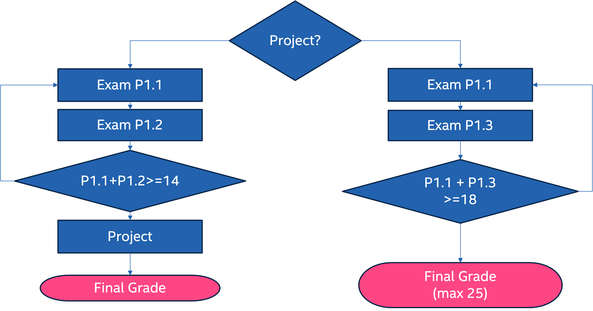

# Exam rules

## Exam workflow

The exam follows the following workflow that is different for students working on a project and students that decided to skip the project. 



### Part 1.1 (mandatory for all students)

Written test that covers all topics discussed in class. 

The test may include various types of questions, such as:

* multiple-choice questions
* exercises focusing on specific topics
* The test is given using Moodle (the online platform used at Polito for delivering exams) and Lockdown browser (a progran that locks your computer in the exam platform and allows you to access only the required resources).
* Each question is assigned a score, which is announced during the exam. 

**The maximum score achievable in this part is 18**

**The duration of the test is 60 minutes.**

> [!important]
> The lockdown browser works only for windows or MacOS. It is not compatible with Linux!!!

### Part 1.2 (Only for students with an assigned project)

Written test with additional questions for students working on the project that are not requested to give the programming part of the written exam.

Questions more oriented to the programming topics covered during the course

The test may include various types of questions, such as:

* multiple-choice questions
* exercises focusing on specific topics

The test is given using Moodle and Lockdown browser

Each question is assigned a score, which is announced during the exam. 

**The maximum score achievable in this part is 7.**

**The duration of the test is 15~30 minutes.**

### Part 1.3 (Only for students without an assigned project)

1 or 2 programming exercises that can cover FreeRTOS, ARM assembly programming, Linux Device drivers.

**The test is developed on computer without using lockdown browser.**
You will have  access to the toolchain and documentation:

* The allowed documentation is provided during the exam
* The use of Copilot or other generative AI is forbidden. **Any violation will be reported to the dedicated authority and a suspension of the career for 1 year will be requested.**

**The maximum score achievable in this part is 7.**

**The duration of the test is 30~40 minutes.**

## Project

Detailed information about the project is available [HERE](https://baltig.polito.it/teaching-material/02npsov-operating-systems-for-embedded-systems/EOS/-/blob/main/Projects.md).

> [!warning]
> If you fail to pass the project within one year and you aready passed part 1.1 and 1.2, you will be required to attend part 1.3.

## Final grade calculation

```
if (project == 'yes') {
    //EXAM WITH PROJECT
    if (part1.1 + part 1.2 >= 14) {
        grade = part1.1 + part1.2 + project;
        if (grade > = 18) {
            printf ("Exam passed.\n");
            printf ("If you reject your grade you have to retake parts 1.1 and 1.2 but the project will remain valid.\n");
        } else {
            printf ("Exam failed. \n");
            prntf ("You have to retake parts 1.1 and 1.2 but the project will remain valid.\n
        }
    }  else {
        printf ("Exam failed. \n");
        prntf ("You have to retake parts 1.1 and 1.2 but the project will remain valid.\n
    }
} else {
    //EXAM WITHOUT PROJECT
    grade = part1.1 + part1.3;
    if (grade >= 18) {
            printf ("Exam passed.\n");
            printf ("If you reject your grade you have to retake parts 1.1 and 1.3.\n");
    } else {
            printf ("Exam failed. \n");
            printf ("You have to retake parts 1.1 and 1.3.\n");
    }
}
```

## Midterm assessments

These assessment will be delivered during the semester and, if positive, allow you to skip parts 1.1 and 1.2 of the exam.

* 3 assessments during the official schedule
* Each covers only the topics of its period
* Each worth 1/3 of the total points for Part 1.1 & 1.2

Evaluation Rules:

* **With project:** score ≥14 in Part 1.1 + 1.2 → skip exam, only project
* **Without project:** if satisfied with Part 1.1 score → exam covers only Part 1.3

> [!important]
> If you attend the written exam the results of the assessment are invalidated.

> [!important]
> Only new students enrolled this academic year can attend the midterm assessments. Your status will be checked based on the information available in the teaching portal database.