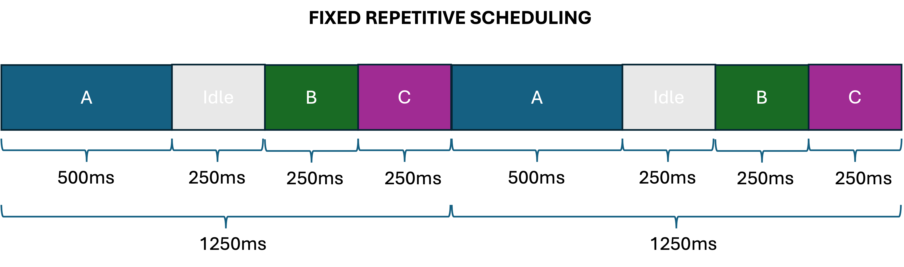

# Exercise 1 - FreeRTOS tasks

Create a FreeRTOS project based on the template available here: [https://baltig.polito.it/teaching-material/exercises-caos-and-os/FreeRTOSsampleapp](https://baltig.polito.it/teaching-material/exercises-caos-and-os/FreeRTOSsampleapp).

```
├── App
│   ├── FreeRTOSConfig.h
│   ├── Makefile
│   ├── main.c
│   ├── mps2_m3.ld
│   ├── startup.c
│   ├── uart.c
│   └── uart.h
└── README.md
```
The application must run four tasks and implement a fixed, repetitive scheduling scheme, as illustrated in the following figure:



* **Task A**: Generates a random number *n* between 1 and 30, computes its factorial, and prints the result on the screen.
* **Task B**: Generates a random number *n* between 1000 and 2000 and computes the sum of the first nn numbers.
* **Task C**: Generates a random number *n*, computes the number of bits set to one in *n* using inline ARM assembly code, and prints the result on the screen.
The scheduling algorithm organizes execution into cycles of 1250 ms. Denoting the start of the cycle as *t*:

* Task A must start at time *t*.
* Task B must start at time *t* + 750 ms.
* Task C must start at time *t* + 1000 ms.

Each task is assigned a fixed time slot:

* Task A: 500 ms
* Task B: 250 ms
* Task C: 250 ms

If a task is still running when its assigned time slot ends, it must be preempted and terminated. A new istance of the task must be created during the next cycle.


**When you submit your exam only the App folder must be included in the ZIP.**

Refer to the FreeRTOS documentation here: [https://www.freertos.org/Documentation/00-Overview](https://www.freertos.org/Documentation/00-Overview)
